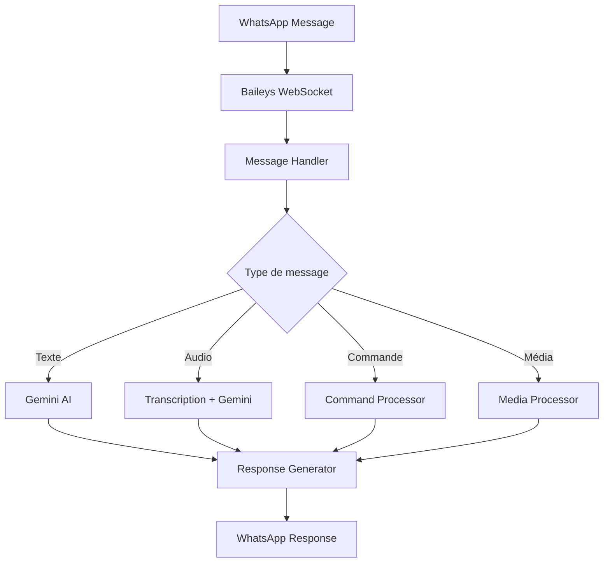

# 🤖 Aquila Bot - Bot WhatsApp Intelligent

[](https://nodejs.org/)
[](https://github.com/WhiskeySockets/Baileys)
[](https://ai.google.dev/)
[](https://opensource.org/licenses/ISC)

> **Aquila Bot** est un bot WhatsApp avancé développé par **Essoya le prince myènè**, intégrant l'intelligence artificielle Gemini, le traitement multimédia, et des fonctionnalités de recherche web. Conçu pour offrir une expérience utilisateur riche et interactive.

## 📋 Table des matières

- [🎯 Vue d'ensemble](#-vue-densemble)
- [✨ Fonctionnalités](#-fonctionnalités)
- [🏗️ Architecture technique](#️-architecture-technique)
- [📚 Technologies utilisées](#-technologies-utilisées)
- [🚀 Installation et configuration](#-installation-et-configuration)
- [💻 Utilisation](#-utilisation)
- [🔧 Commandes disponibles](#-commandes-disponibles)
- [📊 Analyse du code](#-analyse-du-code)
- [🔍 Points d'amélioration](#-points-damélioration)
- [🚀 Déploiement](#-déploiement)
- [🤝 Contribution](#-contribution)
- [📄 Licence](#-licence)

## 🎯 Vue d'ensemble

Aquila Bot est un assistant WhatsApp intelligent qui combine plusieurs technologies de pointe pour offrir une expérience utilisateur complète. Le bot intègre l'IA conversationnelle, le traitement multimédia, la recherche web et des fonctionnalités de téléchargement.

### Caractéristiques principales

- **🧠 Intelligence Artificielle** : Propulsé par Gemini 1.5 Flash
- **🎵 Support audio** : Transcription et synthèse vocale
- **🖼️ Traitement multimédia** : Conversion de formats (stickers, images, vidéos)
- **🌐 Recherche web** : Intégration Google Search et Images
- **📱 Interface intuitive** : Menus visuels et commandes simples
- **👥 Support groupes** : Gestion intelligente des conversations de groupe

## ✨ Fonctionnalités

### 🤖 Intelligence Artificielle
- **Réponses contextuelles** : Compréhension et génération de réponses intelligentes
- **Support multilingue** : Optimisé pour le français avec humour noir et intellectuel
- **Notes vocales** : Transcription automatique et réponse vocale
- **Filtrage de contenu** : Blocage automatique des contenus inappropriés
- **Personnalisation** : Comportement adaptatif selon l'utilisateur (créateur vs utilisateur standard)

### 🎨 Traitement multimédia
- **Conversion stickers** : Image/vidéo → Sticker (animé pour les vidéos)
- **Conversion inverse** : Sticker → Image/vidéo
- **Téléchargement statuts** : Récupération des statuts WhatsApp
- **YouTube** : Téléchargement de vidéos avec audio de qualité
- **Optimisation** : Redimensionnement automatique (512x512 pour stickers)

### 🌐 Recherche et découverte
- **Google Search** : Recherche textuelle avec résultats pertinents
- **Google Images** : Recherche et envoi d'images
- **Intégration fluide** : Résultats directement dans WhatsApp

### 👥 Gestion des conversations
- **Support groupes** : Réponses contextuelles avec mentions
- **Anti-spam** : Protection contre les messages dupliqués
- **Présence** : Indicateurs de frappe et d'enregistrement
- **Menus interactifs** : Interface utilisateur avec images et GIFs

## 🏗️ Architecture technique

### Structure du projet
```
Bot/
├── bot.js                 # Fichier principal (2042 lignes)
├── server.js              # Serveur Express
├── package.json           # Dépendances et scripts
├── README.md              # Documentation de base
├── auth_info/             # Sessions WhatsApp
├── images/                # Médias pour menus
│   └── menu.jpg
├── videos/                # Vidéos pour menus
│   └── menu.mp4
└── node_modules/          # Dépendances Node.js
```

### Flux de données


### Gestion des états
- **Sessions persistantes** : Stockage des données d'authentification
- **Cache anti-spam** : Prévention des messages dupliqués
- **Gestion d'erreurs** : Reconnexion automatique et fallbacks

## 📚 Technologies utilisées

### Core WhatsApp
| Bibliothèque | Version | Rôle |
|--------------|---------|------|
| `baileys` | 7.0.0-rc.2 | Interface WhatsApp Web |
| `pino` | 9.9.5 | Système de logging |

### Intelligence Artificielle
| Service | Utilisation |
|---------|-------------|
| **Gemini 1.5 Flash** | Génération de réponses |
| **Google Text-to-Speech** | Synthèse vocale |

### Traitement multimédia
| Outil | Rôle |
|-------|------|
| **FFmpeg** | Conversion de formats |
| `ytdl-core` | Téléchargement YouTube |

### APIs et services
| Bibliothèque | Version | Rôle |
|--------------|---------|------|
| `axios` | 1.12.1 | Requêtes HTTP |
| `googlethis` | 1.8.0 | Recherche Google |

### Infrastructure
| Outil | Rôle |
|-------|------|
| `express` | Serveur web |
| `dotenv` | Variables d'environnement |
| `qrcode` | Authentification QR |

## 🚀 Installation et configuration

### Prérequis
- **Node.js** 18+ 
- **FFmpeg** installé et dans le PATH
- **Compte WhatsApp** pour l'authentification
- **Clé API Gemini** (Google Cloud Console)

### Installation rapide
```bash
# Cloner le projet
git clone <repository-url>
cd Bot

# Installer les dépendances
npm install

# Installer FFmpeg (Ubuntu/Debian)
sudo apt update && sudo apt install ffmpeg

# Configurer les variables d'environnement
cp .env.example .env
# Éditer .env avec vos clés API
```

### Configuration détaillée

#### 1. Variables d'environnement
```env
# .env
GEMINI_API_KEY=votre_cle_api_gemini
SESSION_DIR=./auth_info
PORT=3000
```

#### 2. Obtenir une clé API Gemini
1. Aller sur [Google Cloud Console](https://console.cloud.google.com/)
2. Créer un nouveau projet ou sélectionner un existant
3. Activer l'API Gemini
4. Créer des identifiants (clé API)
5. Copier la clé dans `.env`

#### 3. Préparer les médias
```bash
# Créer les dossiers
mkdir images videos

# Ajouter vos fichiers
# images/menu.jpg (pour -help)
# videos/menu.mp4 (pour -menu)
```

### Démarrage
```bash
# Mode production
npm start

# Mode développement (avec rechargement)
npx nodemon server.js
```

## 💻 Utilisation

### Première connexion
1. Lancer le bot : `npm start`
2. Scanner le QR code affiché avec WhatsApp
3. Attendre la confirmation "Connecté à WhatsApp !"

### Types d'interaction

#### Messages texte
```
Utilisateur: "Quelle est la capitale de la France ?"
Bot: "La capitale de la France est Paris..."
```

#### Notes vocales
```
Utilisateur: [Envoie une note vocale]
Bot: [Transcrit et répond par audio ou texte]
```

#### Commandes
```
Utilisateur: "-help"
Bot: [Affiche le menu avec image]
```

## 🔧 Commandes disponibles

| Commande | Description | Exemple |
|----------|-------------|---------|
| `-help` | Menu avec image | `-help` |
| `-menu` | Menu avec GIF | `-menu` |
| `-info` | Informations du bot | `-info` |
| `-sticker` | Convertir média en sticker | Citer une image + `-sticker` |
| `-image` | Convertir sticker en image | Citer un sticker + `-image` |
| `-video` | Convertir sticker en vidéo | Citer un sticker animé + `-video` |
| `-download` | Télécharger un statut | Citer un statut + `-download` |
| `-yt <url>` | Télécharger vidéo YouTube | `-yt https://youtube.com/watch?v=...` |
| `-find <query>` | Recherche Google | `-find "intelligence artificielle"` |
| `-gimage <query>` | Recherche d'image | `-gimage "chat mignon"` |
| `-creator` | Contact du créateur | `-creator` |

### Utilisation dans les groupes
- **Mentionner** : `@AquilaBot comment ça va ?`
- **Répondre** : Répondre à un message du bot
- **Commandes** : Utiliser le préfixe `-` normalement

## 📊 Analyse du code

### Métriques
- **Lignes de code** : 2042 lignes
- **Fichiers principaux** : 2 (bot.js, server.js)
- **Fonctions** : 15+ fonctions principales
- **Dépendances** : 8 bibliothèques externes

### Structure du code
```javascript
// Organisation actuelle
bot.js
├── Imports et configuration
├── Fonctions utilitaires
│   ├── askGemini()
│   ├── textToAudio()
│   ├── mediaToSticker()
│   └── ...
├── Fonctions de menu
│   ├── showMenuImage()
│   └── showMenuVideo()
└── Fonction principale startBot()
    ├── Configuration socket
    ├── Gestion des messages
    └── Gestion des événements
```

### Points forts du code
✅ **Fonctionnalités complètes** : IA, médias, recherche  
✅ **Gestion d'erreurs** : Try-catch et fallbacks  
✅ **Anti-spam** : Protection contre les doublons  
✅ **Support multilingue** : Optimisé français  
✅ **Documentation** : Commentaires explicatifs  

### Points d'amélioration
🔧 **Monolithique** : Tout dans un seul fichier  
🔧 **Pas de tests** : Aucun test automatisé  
🔧 **Gestion d'état** : Cache simple en mémoire  
🔧 **Sécurité** : Validation d'entrée limitée  
🔧 **Performance** : Pas de cache externe  

## 🔍 Points d'amélioration

### Architecture
- [ ] **Modularisation** : Séparer en modules (handlers, services, utils)
- [ ] **Configuration** : Fichier de config centralisé
- [ ] **Middleware** : Système de middleware pour les requêtes
- [ ] **Dependency Injection** : Injection de dépendances

### Performance
- [ ] **Cache Redis** : Cache externe pour les réponses
- [ ] **Rate limiting** : Limitation des requêtes par utilisateur
- [ ] **Queue système** : File d'attente pour les tâches lourdes
- [ ] **Compression** : Compression des médias

### Sécurité
- [ ] **Validation** : Sanitisation des inputs
- [ ] **Whitelist** : Contrôle d'accès par utilisateur
- [ ] **Chiffrement** : Protection des données sensibles
- [ ] **Audit logs** : Traçabilité des actions

### Monitoring
- [ ] **Métriques** : Collecte de métriques d'utilisation
- [ ] **Health checks** : Vérification de l'état du bot
- [ ] **Alertes** : Notifications en cas de problème
- [ ] **Dashboard** : Interface de monitoring

### Tests
- [ ] **Tests unitaires** : Tests des fonctions individuelles
- [ ] **Tests d'intégration** : Tests des flux complets
- [ ] **Tests E2E** : Tests bout en bout
- [ ] **Coverage** : Couverture de code

## 🚀 Déploiement

### Déploiement local
```bash
# Installation
npm install
npm start

# Variables d'environnement
export GEMINI_API_KEY="votre_cle"
export PORT=3000
```

### Déploiement cloud (Render)
1. **Créer un compte** sur [Render](https://render.com/)
2. **Connecter le repository** Git
3. **Configurer** les variables d'environnement
4. **Déployer** automatiquement

### Docker (recommandé)
```dockerfile
# Dockerfile
FROM node:18-alpine
RUN apk add --no-cache ffmpeg
WORKDIR /app
COPY package*.json ./
RUN npm install
COPY . .
EXPOSE 3000
CMD ["npm", "start"]
```

### Variables d'environnement de production
```env
NODE_ENV=production
GEMINI_API_KEY=your_production_key
SESSION_DIR=/app/auth_info
PORT=3000
LOG_LEVEL=info
```

## 🤝 Contribution

### Comment contribuer
1. **Fork** le projet
2. **Créer** une branche feature (`git checkout -b feature/AmazingFeature`)
3. **Commit** vos changements (`git commit -m 'Add some AmazingFeature'`)
4. **Push** vers la branche (`git push origin feature/AmazingFeature`)
5. **Ouvrir** une Pull Request

### Standards de code
- **ESLint** : Respecter les règles de linting
- **Prettier** : Formatage automatique
- **Conventional Commits** : Messages de commit standardisés
- **Tests** : Ajouter des tests pour les nouvelles fonctionnalités

### Roadmap
- [ ] **v2.0** : Refactoring complet avec TypeScript
- [ ] **v2.1** : Base de données et persistance
- [ ] **v2.2** : Interface web d'administration
- [ ] **v2.3** : Support multi-langues
- [ ] **v2.4** : Intégrations tierces (Discord, Telegram)

## 📄 Licence

Ce projet est sous licence **ISC**. Voir le fichier [LICENSE](LICENSE) pour plus de détails.

### Résumé de la licence
- ✅ **Usage commercial** autorisé
- ✅ **Modification** autorisée
- ✅ **Distribution** autorisée
- ✅ **Usage privé** autorisé
- ❌ **Garantie** non fournie
- ❌ **Responsabilité** limitée

---

## 📞 Support et contact

- **Créateur** : Essoya le prince myènè
- **WhatsApp** : +241066813542
- **Email** : [Votre email]
- **GitHub** : [Votre profil GitHub]

## 🙏 Remerciements

- **Baileys** : Pour l'excellente bibliothèque WhatsApp
- **Google** : Pour Gemini AI et les APIs
- **Communauté** : Pour les retours et contributions

---

<div align="center">

**Fait avec ❤️ par Essoya le prince myènè**

*Aquila Bot - Votre assistant WhatsApp intelligent*

</div>
